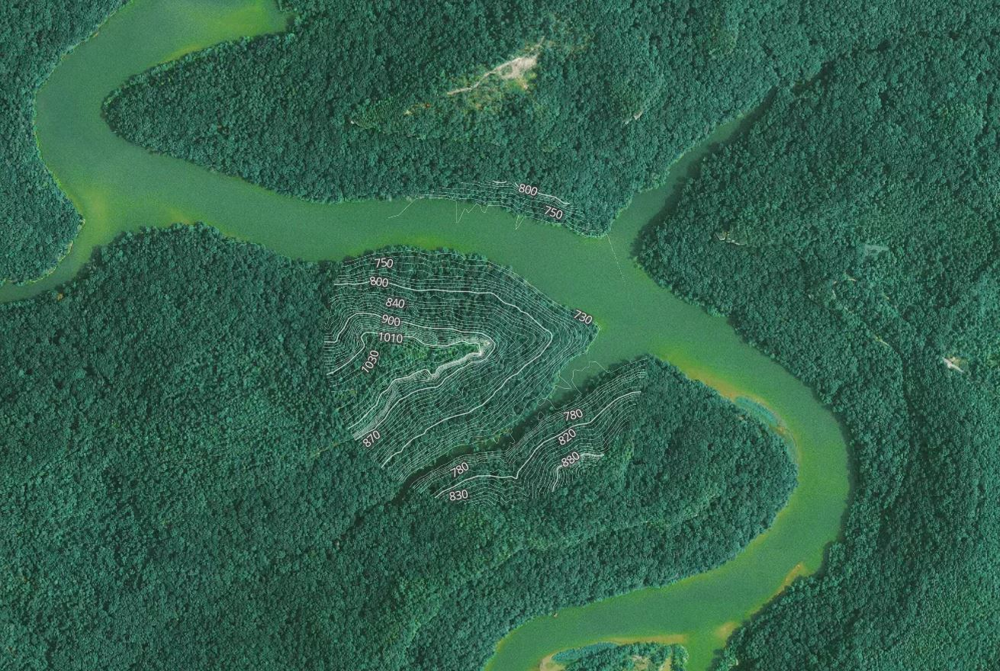
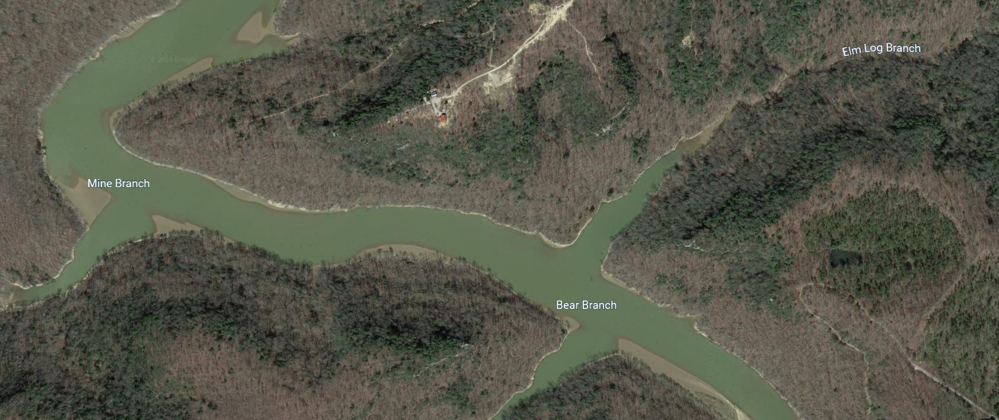
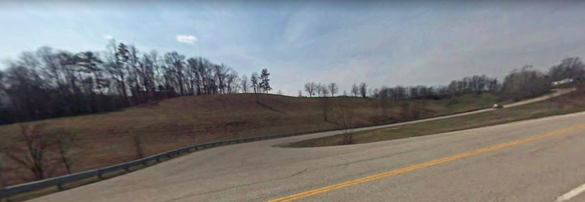

# Twin Hollows of Cave Run Lake

Kentucky's Cave Run Lake and it's *'Twin Hollows'* are well known in the area for their fishing stories and prominent ridgeline that run their perimeter. Although not a formal name, The Twin Hollows can be recognized and understood region wide. 

### Goal of the Project: 

* The aim of this project was to further explore the terrrain of the land along the ouskirts of the Twin Hollows. While also putting the pillar on display that runs along its perimeter, towering over the water at around 100 feet. 

### Area of Interest

* As I said above, the Twin Hollows are a long standing landmark for fisherman and boaters alike. Their location is close to many boat ramps and their placement directly across from each other on the sides of the river channel gives them their 'Twin' name.

     
*Contours of the Twin Hollows*

*Initial map of hillshade and contours in ArcGIS Pro*

     
*Layout showing Cliffs Over 30ft*

### Tools & Sources Used:

* ArcGIS Pro lidar and digital surface model tools were used to geoprocess and manipulate the data for the views shown in this document. A Python script was used to automate this process making the majority of the work lie within the cartography. 
* Pillars extracted from the Domestic and Antarctic Names (State and Topical Gazetteer) published by the United States Board on Geographic Names. 

### Metadata

* This analysis was imagined by Spencer E. Price and used for a project in GEO 409 at the University of Kentucky, spring 2020. 

## Further look into the Twin Hollows

     
*Other landmarks and 'well-knowns' near the Twin Hollows*

     
*Campsite along the Twin Hollows*

     
*House atop one of the Twin Hollows*

*Access from the road via KY 519*